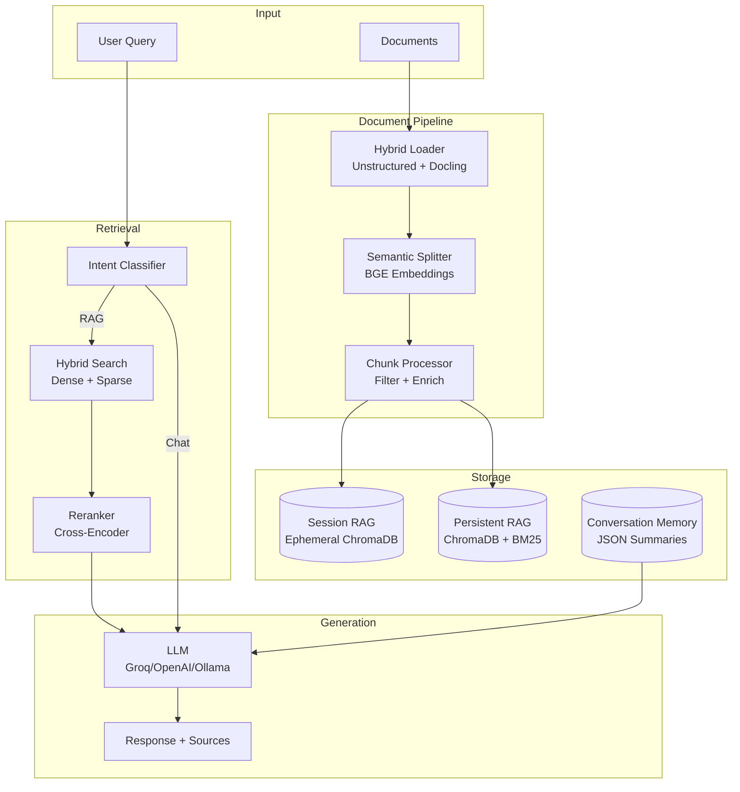
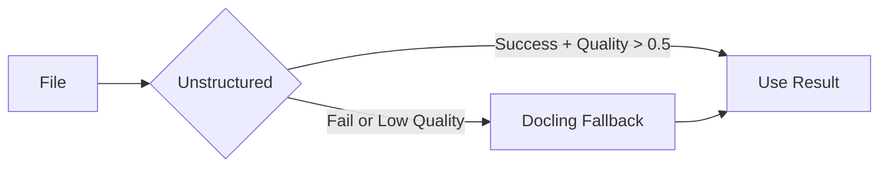
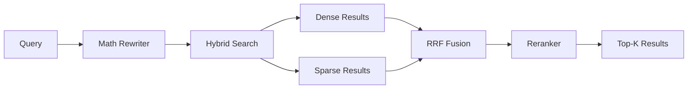
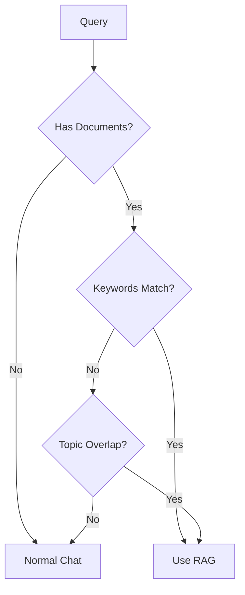
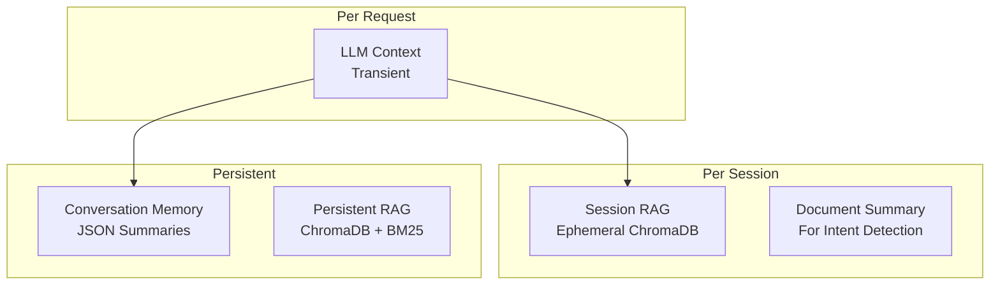

# EVA RAG - Architecture Documentation

Complete technical documentation for EVA's Retrieval-Augmented Generation system.

---

## Table of Contents

1. [Overview](#overview)
2. [System Architecture](#system-architecture)
3. [Components](#components)
4. [Data Flow](#data-flow)
5. [Memory Model](#memory-model)
6. [File Structure](#file-structure)
7. [API Reference](#api-reference)
8. [Usage Examples](#usage-examples)

---

## Overview

EVA is a modular AI assistant with multi-provider LLM support and a sophisticated RAG pipeline. The system enables:

- **Document Ingestion** - Parse PDFs, DOCX, images, and 20+ formats
- **Intelligent Chunking** - Semantic splitting using BGE embeddings
- **Hybrid Retrieval** - Dense (ChromaDB) + Sparse (BM25) search
- **Session-Based Memory** - Ephemeral documents + persistent summaries
- **Intent-Based Routing** - Automatic RAG vs normal chat decision

---

## System Architecture



---

## Components

### 1. Document Loading

| Component | File | Purpose |
|-----------|------|---------|
| `DoclingLoader` | `document_loader.py` | IBM Docling - accurate OCR for complex PDFs |
| `UnstructuredLoader` | `unstructured_loader.py` | Fast parsing for simple documents |
| `HybridDocumentLoader` | `document_loader.py` | Confidence-based routing between loaders |

**Supported Formats:**

| Category | Formats |
|----------|---------|
| Documents | PDF, DOCX, DOC, PPTX, PPT, XLSX, XLS, HTML, MD |
| OpenDocument | ODT, ODP, ODS |
| Images (OCR) | PNG, JPG, JPEG, TIFF, BMP, WebP |
| Text | TXT, CSV, JSON, XML, YAML, RST, TEX |

**Flow:**


---

### 2. Text Splitting

| Component | File | Purpose |
|-----------|------|---------|
| `SemanticSplitter` | `semantic_splitter.py` | Split at semantic boundaries using embeddings |
| `RecursiveCharacterTextSplitter` | LangChain | Fast character-based splitting |

**Semantic Splitting Process:**
1. Embed each sentence with BGE model
2. Calculate cosine similarity between adjacent sentences
3. Split where similarity drops below threshold (semantic boundary)

---

### 3. Chunk Processing

| Component | File | Purpose |
|-----------|------|---------|
| `ChunkProcessor` | `chunk_processor.py` | Filter noise + enrich with metadata |

**Filtering:**
- Minimum length: 30 characters
- Maximum length: 15,000 characters
- Garbage ratio: < 70% non-alphabetic
- Duplicate detection: Content hash

**Enrichment:**
- Keywords extraction (TF-IDF-like)
- Math content detection
- Code content detection
- Category classification

---

### 4. Vector Storage

| Component | File | Purpose |
|-----------|------|---------|
| `VectorStore` | `vector_store.py` | Persistent ChromaDB + BM25 hybrid store |
| `SessionRAG` | `session_rag.py` | Ephemeral session-scoped ChromaDB |

**Hybrid Search (RRF):**
```python
# Reciprocal Rank Fusion
score = Σ 1/(k + rank_i) for each retriever
```

---

### 5. Retrieval

| Component | File | Purpose |
|-----------|------|---------|
| `RAGRetriever` | `retriever.py` | Orchestrates retrieval pipeline |
| `MathQueryRewriter` | `retriever.py` | Expands math notation for better matching |
| `Reranker` | `retriever.py` | Cross-encoder reranking |

**Retrieval Flow:**


---

### 6. Agent

| Component | File | Purpose |
|-----------|------|---------|
| `EVAAgent` | `agent.py` | Main agent with session management |
| `ConversationMemory` | `conversation_memory.py` | Persistent user summaries |
| `needs_rag` | `intent_classifier.py` | RAG vs chat routing |

**Intent Classification Flow:**


---

## Memory Model

EVA uses a **3-memory coordinated system**:



| Memory | Scope | Lifecycle | Storage |
|--------|-------|-----------|---------|
| Session RAG | Per session | Deleted on `/end` | Temp directory |
| Document Summary | Per session | Deleted on `/end` | In-memory |
| Conversation Memory | Per user | Persistent | `memory/*.json` |
| Persistent RAG | Global | Persistent | `rag_data/` |

---

## File Structure

```
eva_rag/
├── models.py                    # LLM configuration (Groq, OpenAI, etc.)
├── requirements.txt             # Python dependencies
├── .env                         # API keys (gitignored)
│
├── eva/
│   ├── eva_pro.sh               # Main CLI interface
│   ├── eva_backend.py           # Ollama integration
│   ├── memory.py                # Simple memory commands
│   └── prompt_template.txt      # EVA persona
│
├── rag/
│   ├── __init__.py              # Module exports
│   │
│   │-- Document Loading
│   ├── document_loader.py       # Hybrid loader (Unstructured + Docling)
│   ├── unstructured_loader.py   # Fast parsing
│   ├── extraction_quality.py    # Quality assessment
│   │
│   │-- Text Processing
│   ├── semantic_splitter.py     # Semantic chunking
│   ├── chunk_processor.py       # Filtering + enrichment
│   │
│   │-- Storage & Retrieval
│   ├── vector_store.py          # ChromaDB + BM25
│   ├── retriever.py             # Hybrid retrieval + reranking
│   ├── rag_pipeline.py          # Full pipeline (ingest → query)
│   │
│   │-- Session Agent
│   ├── session_rag.py           # Ephemeral session store
│   ├── conversation_memory.py   # Persistent summaries
│   ├── intent_classifier.py     # RAG vs chat decision
│   └── agent.py                 # EVAAgent class
│
├── rag_data/                    # Persistent vector database
│   ├── chroma.sqlite3
│   ├── documents.pkl
│   └── config.pkl
│
└── memory/                      # Conversation summaries
    └── conversation_memory.json
```

---

## API Reference

### RAGPipeline (Persistent)

```python
from rag import RAGPipeline

# Create pipeline
rag = RAGPipeline(persist_dir="./rag_data")

# Ingest documents
rag.ingest("document.pdf")
rag.ingest_directory("./docs/")
rag.save()

# Query
response = rag.query("What is X?")
print(response.answer)
print(response.sources)
```

### EVAAgent (Session-Based)

```python
from rag import EVAAgent

# Create agent
agent = EVAAgent(user_id="het")

# Ingest to session (ephemeral)
agent.ingest("document.pdf")

# Chat (auto-routes RAG vs normal)
response = agent.chat("What does the document say?")
print(response.answer)
print(response.used_rag)  # True
print(response.sources)   # ["document.pdf"]

response = agent.chat("Hello!")
print(response.used_rag)  # False

# End session (clears documents)
agent.end_session()
```

### Low-Level Components

```python
from rag import (
    load_and_split,
    ChunkProcessor,
    VectorStore,
    RAGRetriever,
    SessionRAG,
    ConversationMemory,
    needs_rag,
)

# Load and split
chunks = load_and_split("doc.pdf", chunk_size=500, semantic=True)

# Process
processor = ChunkProcessor()
processed = processor.process(chunks)

# Store
store = VectorStore("my_kb", persist_directory="./data")
store.add_documents(processed)

# Retrieve
retriever = RAGRetriever(store, use_reranker=True)
results = retriever.retrieve("query", top_k=5)
```

---

## Usage Examples

### CLI - Persistent RAG

```bash
# Ingest documents
eva ingest document.pdf
eva ingest ./documents/

# Ask questions
eva ask "What is machine learning?"

# Interactive chat
eva chat

# Check status
eva status
```

### CLI - Session Agent

```bash
python3 rag/agent.py --user het chat
```

```
Commands: /ingest <file>, /status, /end, /quit, /help

You: /ingest notes.pdf
✓ Added 12 chunks to session

You: /status
  Documents: 12
  Summary: Notes about Python programming...

You: What does the document say about functions?
EVA: The document explains that functions are...
  [RAG: notes.pdf]

You: Hello!
EVA: Hi there! How can I help you?
  (No RAG - normal chat)

You: /end
✓ Session cleared
```

---

## Dependencies

| Package | Purpose |
|---------|---------|
| `langchain` | Core framework |
| `langchain-chroma` | ChromaDB integration |
| `langchain-huggingface` | HuggingFace embeddings |
| `sentence-transformers` | BGE embeddings + CrossEncoder |
| `chromadb` | Vector database |
| `rank-bm25` | Sparse retrieval |
| `docling` | Document parsing (IBM Research) |
| `unstructured` | Fast document parsing |
| `sympy` | Math expression parsing |
| `langgraph` | Agent orchestration |
| `groq` | LLM provider |

---

## Configuration

### models.py

```python
from models import ModelConfig, Provider

CHAT_MODEL = ModelConfig(
    provider=Provider.GROQ,
    model_name="llama-3.1-70b-versatile",
    temperature=0.7,
    max_tokens=2048,
)

EMBEDDING_MODEL = "BAAI/bge-large-en-v1.5"
```

### .env

```env
GROQ_API_KEY=gsk_...
OPENAI_API_KEY=sk-...
ANTHROPIC_API_KEY=sk-ant-...
```

---

## Author

Het Patel ([@Het2239](https://github.com/Het2239))

## License

MIT
