# EVA Technical Guide

A comprehensive guide to EVA's RAG pipeline, voice system, and tunable parameters.

---

## Table of Contents

1. [System Overview](#system-overview)
2. [Complete Pipeline Flowchart](#complete-pipeline-flowchart)
3. [Document Ingestion Pipeline](#document-ingestion-pipeline)
4. [Retrieval Pipeline](#retrieval-pipeline)
5. [Voice System](#voice-system)
6. [Tunable Parameters](#tunable-parameters)
7. [Code Locations](#code-locations)

---

## System Overview

EVA is a modular AI assistant with:
- **RAG Pipeline**: Document ingestion → Chunking → Retrieval → LLM Response
- **Voice System**: Speech-to-Text (Whisper) + Text-to-Speech (Piper)
- **Multi-Provider LLM**: Groq, OpenAI, Anthropic, Ollama

```mermaid
flowchart TB
    subgraph "Input Layer"
        V[🎤 Voice Input]
        T[⌨️ Text Input]
        D[📄 Documents]
    end
    
    subgraph "Processing"
        STT[Whisper STT]
        IC[Intent Classifier]
        DP[Document Pipeline]
    end
    
    subgraph "Storage"
        SR[(Session RAG)]
        PR[(Persistent RAG)]
        CM[(Conversation Memory)]
    end
    
    subgraph "Retrieval"
        HR[Hybrid Retrieval]
        RR[Reranker]
    end
    
    subgraph "Output"
        LLM[LLM Generation]
        TTS[Piper TTS]
        R[📤 Response]
    end
    
    V --> STT --> IC
    T --> IC
    D --> DP --> SR & PR
    
    IC -->|RAG| HR --> RR --> LLM
    IC -->|Chat| LLM
    CM --> LLM
    
    LLM --> R
    LLM --> TTS --> V
```



---

## Complete Pipeline Flowchart

### Query Processing Flow


---

## Document Ingestion Pipeline

### Flow Diagram


### Key Code Locations

| Component | File | Function |
|-----------|------|----------|
| Hybrid Loader | `rag/document_loader.py` | `HybridDocumentLoader.load()` |
| Semantic Splitter | `rag/semantic_splitter.py` | `SemanticSplitter.split_documents()` |
| Chunk Processor | `rag/chunk_processor.py` | `ChunkProcessor.process()` |
| Vector Store | `rag/vector_store.py` | `VectorStore.add_documents()` |

---

## Retrieval Pipeline

### Hybrid Search with RRF


### RRF Formula

```python
# Reciprocal Rank Fusion
# File: rag/vector_store.py, Function: _rrf_fusion()

def rrf_score(ranks, k=60):
    """
    RRF combines rankings from multiple retrievers.
    
    score = Σ 1/(k + rank_i) for each retriever
    
    Higher k = more trust in individual retrievers
    Lower k = more aggressive combination
    """
    return sum(1.0 / (k + rank) for rank in ranks)
```

---

## Voice System

### Architecture

```mermaid
flowchart LR
    subgraph "Input"
        M[🎤 Microphone]
    end
    
    subgraph "Speech-to-Text"
        M --> R[Audio Recording]
        R --> S[Silence Detection]
        S --> W[Whisper Model]
        W --> T[Text]
    end
    
    subgraph "Processing"
        T --> A[EVA Agent]
        A --> P[Process Query]
    end
    
    subgraph "Text-to-Speech"
        P --> O[Response Text]
        O --> PI[Piper Binary]
        PI --> AU[Audio WAV]
        AU --> PL[Audio Player]
    end
    
    subgraph "Output"
        PL --> SP[🔊 Speaker]
    end
```



### Key Files

| Component | File | Class/Function |
|-----------|------|----------------|
| Speech Engine | `eva/speech.py` | `SpeechEngine` |
| STT (Whisper) | `eva/speech.py` | `SpeechToText` |
| TTS (Piper) | `eva/speech.py` | `TextToSpeech` |
| Voice Agent | `eva/voice_agent.py` | `VoiceAgent` |
| OS Tools | `eva/os_tools.py` | `OSTools` |

---

## Tunable Parameters

### 🎯 Retrieval Accuracy

| Parameter | Location | Default | Range | Effect |
|-----------|----------|---------|-------|--------|
| `top_k` | `retriever.py:RAGRetriever.retrieve()` | 5 | 3-20 | More context = better recall, slower |
| `rerank_candidates` | `retriever.py:RAGRetriever.retrieve()` | 20 | 10-50 | More candidates = better precision |
| `dense_weight` | `retriever.py:RAGRetriever.__init__()` | 0.5 | 0.0-1.0 | 1.0 = dense only, 0.0 = sparse only |
| `use_reranker` | `retriever.py:RAGRetriever.__init__()` | True | bool | Cross-encoder improves precision |

```python
# File: rag/retriever.py, Line ~270
class RAGRetriever:
    def __init__(
        self,
        vector_store,
        rerank_model: str = "cross-encoder/ms-marco-MiniLM-L-6-v2",
        dense_weight: float = 0.5,  # ← Tune this for hybrid balance
        use_reranker: bool = True,   # ← Disable for speed
        use_math_rewriter: bool = True,
    ):
```

---

### 📄 Chunking Quality

| Parameter | Location | Default | Range | Effect |
|-----------|----------|---------|-------|--------|
| `chunk_size` | `semantic_splitter.py` | 500 | 200-1500 | Smaller = precise, Larger = context |
| `similarity_threshold` | `semantic_splitter.py` | 0.5 | 0.3-0.8 | Lower = more splits |
| `min_chunk_length` | `chunk_processor.py` | 30 | 20-100 | Filter short chunks |
| `max_garbage_ratio` | `chunk_processor.py` | 0.7 | 0.5-0.9 | Filter noisy chunks |

```python
# File: rag/chunk_processor.py, Line ~26
class ChunkProcessor:
    def __init__(
        self,
        min_chunk_length: int = 30,        # ← Increase to filter short
        max_chunk_length: int = 15000,     # ← Decrease for smaller chunks
        max_garbage_ratio: float = 0.7,    # ← Decrease for cleaner text
        remove_duplicates: bool = True,
        extract_keywords: bool = True,
    ):
```

---

### 🧠 LLM Configuration

| Parameter | Location | Default | Effect |
|-----------|----------|---------|--------|
| `provider` | `models.py` | GROQ | LLM provider |
| `model_name` | `models.py` | llama-3.1-70b | Model capability |
| `temperature` | `models.py` | 0.7 | 0 = deterministic, 1 = creative |
| `max_tokens` | `models.py` | 2048 | Response length limit |

```python
# File: models.py, Line ~50
CHAT_MODEL = ModelConfig(
    provider=Provider.GROQ,
    model_name="llama-3.1-70b-versatile",  # ← Change model
    temperature=0.7,                        # ← Creativity
    max_tokens=2048,                        # ← Response length
)

# Embedding Model
EMBEDDING_MODEL = "BAAI/bge-large-en-v1.5"  # ← Change for quality/speed
```

---

### 🎤 Voice Settings

| Parameter | Location | Default | Effect |
|-----------|----------|---------|--------|
| `whisper_model` | `eva/speech.py` | "base" | base/small/medium/large |
| `silence_threshold` | `eva/speech.py` | 0.01 | Mic sensitivity |
| `silence_duration` | `eva/speech.py` | 1.5 | Seconds before stop |
| `piper_model` | `eva/speech.py` | amy-medium | Voice model |

```python
# File: eva/speech.py, Line ~48
@dataclass
class SpeechConfig:
    wake_word: str = "eva"
    whisper_model: str = "base"       # ← base/small/medium/large
    tts_engine: str = "piper"
    piper_model: str = "en_US-amy-medium.onnx"  # ← Voice
    sample_rate: int = 16000
    silence_threshold: float = 0.01   # ← Mic sensitivity
    silence_duration: float = 1.5     # ← Wait before processing
```

---

## Code Locations

### Quick Reference

| Feature | Primary File | Key Function |
|---------|--------------|--------------|
| **Chat Entry** | `rag/agent.py` | `EVAAgent.chat()` |
| **Document Ingest** | `rag/agent.py` | `EVAAgent.ingest()` |
| **Intent Detection** | `rag/intent_classifier.py` | `classify_intent()` |
| **RAG Query** | `rag/rag_pipeline.py` | `RAGPipeline.query()` |
| **Hybrid Search** | `rag/vector_store.py` | `VectorStore.hybrid_search()` |
| **Reranking** | `rag/retriever.py` | `Reranker.rerank()` |
| **Voice Loop** | `eva/voice_agent.py` | `VoiceAgent.voice_loop()` |
| **TTS** | `eva/speech.py` | `TextToSpeech.speak()` |
| **STT** | `eva/speech.py` | `SpeechToText.transcribe()` |
| **OS Actions** | `eva/os_tools.py` | `OSTools.*` |

---

## Accuracy Improvement Checklist

### Retrieval

- [ ] **Increase `rerank_candidates`** (20 → 50) for better precision
- [ ] **Try larger embedding model** (`bge-large` → `bge-m3`)
- [ ] **Adjust `dense_weight`** based on your document type
- [ ] **Enable math rewriter** for technical documents

### Chunking

- [ ] **Decrease `chunk_size`** (500 → 300) for precise retrieval
- [ ] **Lower `similarity_threshold`** (0.5 → 0.4) for more splits
- [ ] **Increase `min_chunk_length`** to filter noise

### LLM

- [ ] **Use larger model** (8B → 70B) for better reasoning
- [ ] **Lower temperature** (0.7 → 0.3) for factual accuracy
- [ ] **Increase context** by raising `top_k`

---

## Author

Het Patel ([@Het2239](https://github.com/Het2239))
